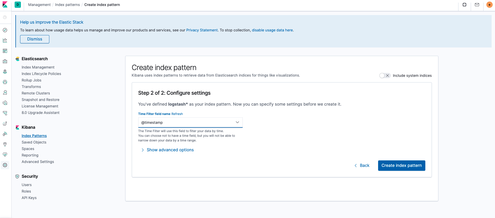

# README Guide for Roman Conversion Project
>Developed by Ram Kumar Balasubramani

**DESCRIPTION**

This project is build on Spring REST API for converting integer number to its equivalent Roman Number.

Sample Rest Endpoint and results.
````
 1) 
 Request: http://localhost:8080/romannumeral?query?=10
 Response : 
        { 
            “input” : “1”, “output” : “X” 
        }
        
 2)
 Request : http://localhost:8080/romannumeral?min=1&max=3
 Response: 
        {
            “conversions”:[
                            { “input” : “1”, “output” : “I” },
                            { “input” : “2”, “output” : “II” },
                            { “input” : “3”, “output” : “III” }
                          ]
         }
    
    
````

##PROJECT PRE-REQUISTES

Based on the operating System, download and install the following softwares

* Java 1.8 or greater (https://www.java.com/en/download/)
* Intellji (https://www.jetbrains.com/idea/download/#section=mac)
* maven 3 or greater (https://maven.apache.org/download.cgi)
* git (https://git-scm.com/downloads)*
* Docker
* Following ports are used by different microservices from this application.Please make sure these port are NOT used by other processes.
* **"8080" , "5000" , "9600" , "9200", "9300", "5601"**

**Set Class path for these softwares and verify each of the commands are successfull**
````
java -version
mvn -v
git --version
```` 


### Instruction for Running Application using for Docker

1. Download the project source code from github directory 
```
git clone https://github.com/rambala06cse/romanconversion_ELK
```
2. Open Intellji -> Open -> Select romanconversion_ELK and load the project. Once the downloaded source code is loaded into IntelliJ, you would see project structure like below.
   
3. Intelli J comes with default Docker plugin. Configure the plugin and make connection successfull.  
   
4. Open Terminal within Intellji and navigate to docker folder. You will find a docker-compose.yml file.
5. Issue docker-compose command below to build docker containers for Elastic Search, Logstash and Kibana
    ````    
    rambala-mac:docker rambala$ pwd
    /Users/rambala/IdeaProjects/romanconversion_ELK/docker
    rambala-mac:docker rambala$ docker-compose -f docker-compose.yml up -d --build
    Creating network "romanconversion_internal" with the default driver
    Creating volume "romanconversion_elasticsearch" with default driver
    Creating romanconversion_elasticsearch_1 ... done
    Creating romanconversion_logstash_1      ... done
    Creating romanconversion_kibana_1        ... done
    rambala-mac:docker rambala$ 
    
    ````

    Verify the Status of the containers running through "docker ps" command.
    ````
    rambala-mac:docker rambala$ docker ps
    CONTAINER ID   IMAGE                 COMMAND                  CREATED         STATUS                            PORTS                                                      NAMES
    217ac0a37d53   kibana:7.6.1          "/usr/local/bin/dumb…"   2 minutes ago   Up 2 minutes                      0.0.0.0:5601->5601/tcp                                     romanconversion_kibana_1
    94a191462abe   logstash:7.6.1        "/usr/local/bin/dock…"   2 minutes ago   Up 2 minutes                      0.0.0.0:5000->5000/tcp, 0.0.0.0:9600->9600/tcp, 5044/tcp   romanconversion_logstash_1
    aba5c7dc6f1f   elasticsearch:7.6.1   "/usr/local/bin/dock…"   2 minutes ago   Up 2 minutes (health: starting)   0.0.0.0:9200->9200/tcp, 0.0.0.0:9300->9300/tcp             romanconversion_elasticsearch_1
    rambala-mac:docker rambala$ 
    ````    

6. Goto to another terminal within Intellji and run Maven to bring up the JAVA REST Service.
```
rambala-mac:romanconversion rambala$ pwd
/Users/rambala/IdeaProjects/romanconversion
rambala-mac:romanconversion rambala$ mvn clean install

run "mvn clean install"   

Running above command would result in BUILD SUCCESS message as below.

[INFO] --- maven-install-plugin:2.5.2:install (default-install) @ romanconversion ---
[INFO] Installing /Users/rambala/IdeaProjects/romanconversion/target/romanconversion-0.0.1-SNAPSHOT.jar to /Users/rambala/.m2/repository/com/romanconversion/0.0.1-SNAPSHOT/romanconversion-0.0.1-SNAPSHOT.jar
[INFO] Installing /Users/rambala/IdeaProjects/romanconversion/pom.xml to /Users/rambala/.m2/repository/com/romanconversion/0.0.1-SNAPSHOT/romanconversion-0.0.1-SNAPSHOT.pom
[INFO] ------------------------------------------------------------------------
[INFO] BUILD SUCCESS
[INFO] ------------------------------------------------------------------------
[INFO] Total time:  9.328 s
[INFO] Finished at: 2021-10-12T21:12:40-06:00
[INFO] ------------------------------------------------------------------------
rambala-mac:romanconversion rambala$ 

```
7. Now you can start the application by using "./mvnw spring-boot:run" in the terminal. Maven Wrapper takes care of the dependecies required for the project and you would see a below message on successfull load.
The application is now currently listening on port 8080. 
```
rambala-mac:romanconversion rambala$ pwd
/Users/rambala/IdeaProjects/romanconversion
rambala-mac:romanconversion rambala$ ./mvnw spring-boot:run

[INFO] <<< spring-boot-maven-plugin:2.5.5:run (default-cli) < test-compile @ romanconversion <<<
[INFO] 
[INFO] 
[INFO] --- spring-boot-maven-plugin:2.5.5:run (default-cli) @ romanconversion ---
[INFO] Attaching agents: []

  .   ____          _            __ _ _
 /\\ / ___'_ __ _ _(_)_ __  __ _ \ \ \ \
( ( )\___ | '_ | '_| | '_ \/ _` | \ \ \ \
 \\/  ___)| |_)| | | | | || (_| |  ) ) ) )
  '  |____| .__|_| |_|_| |_\__, | / / / /
 =========|_|==============|___/=/_/_/_/
 :: Spring Boot ::                (v2.5.5)


```
8. Now there are 4 microservices running on your machine. Goto browser or postman and execute below commands to verify if the application is running.

````
http://localhost:8080/
Welcome Roman Conversion !!!

http://localhost:8080/actuator/health

{"status":"UP"}

````

### Testing
You can either use browser or POSTMAN tool for validating the response

1. Test Case for single number
>http://localhost:8080/romannumeral?query=58


> 
2. Test Case for number range between 1 to 3999
>http://localhost:8080/actuator/shutdown?min=100&max=103
 


3. Testing Code Coverage is more than **80%**
   
4. Application is executed with Junit Test cases covering Unit and Integration Testing
   
5. For Testing Parallel execution of the application, use higher range in the validation
> http://localhost:8080/romannumeral?min=10&max=25

### Error Handling
1. Incorrect Requst are handled and returns bad request for appropriate cases


2. If input Number is given out of range
````
http://localhost:8080/romannumeral?query=4001

HTTP/1.1 400 Bad Request
ERROR: number should be between 1 and 3999
````

3. Incorrect input range
````
http://localhost:8080/romannumeral?min=20&max=15

HTTP/1.1 400 Bad Request
Content-Type: text/plain;charset=UTF-8
Content-Length: 50
Date: Wed, 13 Oct 2021 05:31:07 GMT
Connection: close
Minium Number should be Lesser than Maximum Number
````
### Logging Architecture 

 
1. Java Application logs are sent directly to ELK stack. Logs from Java Rest Service are sent to logstash service through TCP connection using port 5000.

2. Logstash receives the logs and does json processing through one of its plugin and sends it to elasticsearch 
3. elasticsearch then indexes these logs based on its inbuild search engine.
4. Finally the logs can be viwed in kibana.
   
   
5. Kibana Query Language allows to search logs through various indexes.
   

* 

### Shut down application

* Java Application can be exited by running either curl or run the endpoint in browser
    ````
     http://localhost:8080/actuator/shutdown    
     curl -X POST localhost:8080/actuator/shutdown
    
    ````
* Run "docker-compose down" to shut the ELK services.

### Reference Documentation

#### Technologies Used
* *Java*
* Elasticsearch, Logstash, Kibana
* Docker, Docker-Compose
* *SpringBoot*
    * *Junit*
    * *loj4j*

For further reference, please consider the following sections:
* [Roman Numeral Conversion](https://en.wikipedia.org/wiki/Roman_numerals)
* [Official Apache Maven documentation](https://maven.apache.org/guides/index.html)
* [Spring Boot Maven Plugin Reference Guide](https://docs.spring.io/spring-boot/docs/2.5.5/maven-plugin/reference/html/)
* [Create an OCI image](https://docs.spring.io/spring-boot/docs/2.5.5/maven-plugin/reference/html/#build-image)
* [Spring Web](https://docs.spring.io/spring-boot/docs/2.5.5/reference/htmlsingle/#boot-features-developing-web-applications)

